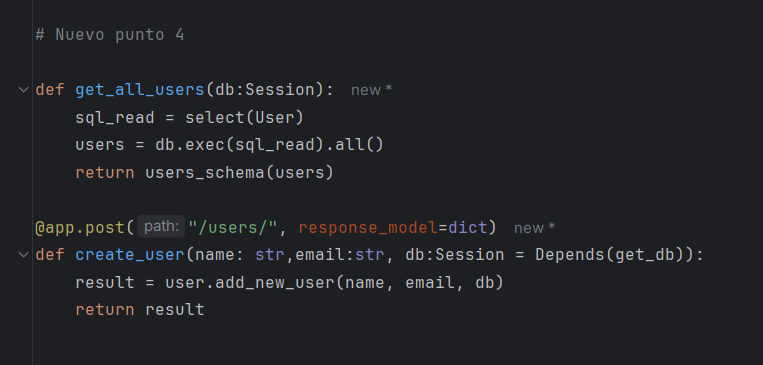

# sge_theBear_grupG

# Projecte FastAPI - DAM1 - Hugo Murillo Caparrós

## Configuració del projecte
### 1. Crear estructura de directoris

Afegir un fitxer `__init__.py` buit a cada carpeta.

### 2. Crear `connect.py`

Fitxer situat a `database/connect.py` per gestionar la connexió a la base de dades amb `psycopg2`

### 3. Crear `read_sch.py`

Fitxer situat a `schema/read_sch.py` per transformar dades en diccionari.

### 4. Crear `read.py`

Fitxer situat a `services/read.py` amb la lògica per gestionar les consultes.

### 5. Crear `main.py`
Fitxer principal que actua com a controlador.

## Execució del projecte
Executar el servidor amb:

python -m uvicorn main:app --reload

Accedir a `http://127.0.0.1:8000` per veure l'API.

Per veure la documentació accedim a `http://127.0.0.1:8000/docs`.

## EXRECICI 2

Instal·lació de dependències

Creem un fitxer requirements.txt i instal·lem les dependències amb pip install -r requirements.txt

Creació del fitxer .env

Afegim el fitxer .env per guardar la URL de connexió a PostgreSQL.

Configuració SQLModel i PostgreSQL

A main.py configurem la connexió a la BD i carreguem les variables d'entorn.

Creació del motor de la BD
Utilitzem create_engine per gestionar la connexió a la BD.

Creació automàtica de taules
El codi crea les taules automàticament a PostgreSQL.

Funció get_db()
Creem get_db() per gestionar sessions amb la BD i tancar-les després d'usar-les.

Model d'usuaris
Definim el model User amb SQLModel per crear la taula d'usuaris a la BD.

Modificació de l’endpoint read
Modifiquem l’endpoint per obtenir tots els usuaris de la BD en format JSON.

Consulta d'usuaris
A user.py afegim el mètode per obtenir tots els usuaris fent SELECT a la BD.

Creació d’un nou endpoint
Afegim un endpoint per inserir nous usuaris a la BD.

Transformació de dades amb schema

Afegim users_sch.py per convertir les dades de la BD en JSON.

Proves i validació
Executem el projecte amb uvicorn main:app --reload i provem els endpoints amb Swagger.

