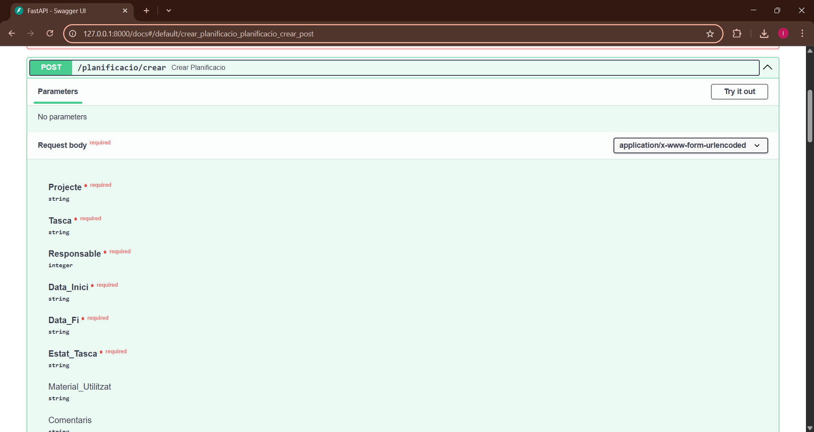
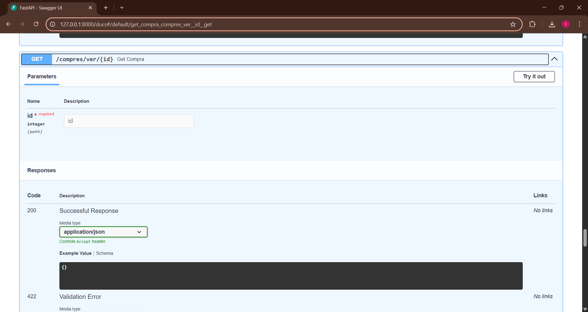

# sge_theBear_grupG
# Mòdul d'Empleats

## Crear Empleat  
 Aquesta captura mostra el formulari per crear un nou empleat. S'han d'omplir camps obligatoris com Nom, Puesto, Departament, Email i Telèfon. L'ID del gerent és opcional. En enviar, s'afegirà un nou empleat a la base de dades.

## Llistar Empleats  
 Aquesta petició GET retorna una llista amb tots els empleats registrats al sistema. Cada empleat es mostra amb tots els seus detalls.

## Obtenir Empleat per ID  
 Introduint un ID específic, es retornen les dades d'un empleat concret. Si l'ID no existeix, es retornarà un error 404.

## Actualitzar Empleat  
 Permet modificar les dades d’un empleat existent. Només cal enviar els camps que es volen canviar.

## Eliminar Empleat  
 Aquesta operació esborra un empleat segons l’ID proporcionat. Si s’elimina correctament, es retorna una confirmació.

---

# Mòdul de Planificació

## Crear Tasca  
 Formulari per crear una nova tasca de planificació. Requereix projecte, tasca, responsable, dates, estat, etc. Els camps de material i comentaris són opcionals.

## Llistar Tasques  
 Retorna totes les tasques planificades. Cada entrada mostra les dades com dates, responsable i estat.

## Obtenir Tasca per ID  
 En introduir l’ID d’una tasca, es mostren els seus detalls complets.

## Actualitzar Tasca  
 Permet modificar una tasca existent. Només cal incloure els camps que es volen actualitzar. La resposta mostra la tasca amb els nous valors.

## Eliminar Tasca  
 Elimina una tasca segons el seu ID. Retorna una resposta de confirmació si es fa correctament.

---

# Mòdul d'Events

## Crear Event  
 Crea un nou esdeveniment introduint la data, hora, ubicació i organitzador. També es pot indicar si és privat.

## Llistar Events  
 Retorna tots els events registrats. Cada event inclou detalls com data, hora, ubicació, estat i entrades disponibles.

## Obtenir Event per ID  
 Mostra les dades d’un esdeveniment concret donat el seu ID.

## Actualitzar Event  
 Aquesta operació permet modificar informació d’un event ja registrat. Pot ser qualsevol camp.

## Eliminar Event  
 Enviant una petició DELETE amb l'ID d'un event, aquest s'eliminarà del sistema. La resposta confirma l'èxit de l'operació.

---

# Mòdul de Costos

## Crear Cost  
 Formulari per registrar un nou cost. Requereix descripció, categoria, quantitat, data i qui l'ha pagat. La resposta mostra el cost creat.

## Llistar Costos  
 Retorna un llistat de totes les despeses registrades.

## Obtenir Cost per ID  
 Mostra el detall d’un cost concret donat el seu ID.

## Actualitzar Cost  
 Permet modificar un cost existent, com canviar la quantitat, data o responsable del pagament.

## Eliminar Cost  
 Elimina una despesa del sistema segons el seu ID. La resposta indica si s’ha completat amb èxit.

---

# Mòdul de Compres

## Crear Compra  
 Permet registrar una nova compra a un proveïdor, incloent producte, quantitat, preu i estat.

## Llistar Compres  
 Mostra totes les compres fetes, útil per fer seguiment de comandes.

## Obtenir Compra per ID  
 Retorna els detalls d'una comanda específica, incloent proveïdor, producte, quantitat, preu i estat.

## Actualitzar Compra  
 Aquesta operació serveix per modificar dades d’una compra, com estat, quantitat o preu.

## Eliminar Compra  
 Suprimeix una compra del sistema indicant l’ID corresponent.

---

# Mòdul de Punts de Venda

## Crear Punt de Venda  
 Registra una nova transacció de venda. Es pot indicar si s’envia tiquet per correu.

## Llistar Punts de Venda  
 Llista totes les vendes realitzades als punts de venda.

## Obtenir Punt de Venda per ID  
 Mostra les dades detallades d’un punt de venda concret.

## Actualitzar Punt de Venda  
 Permet modificar la informació d'un punt de venda. Es poden actualitzar camps com el mètode de pagament o si s'envia tiquet per email.

## Eliminar Punt de Venda  
 Elimina una entrada de venda segons l’ID indicat.

---

# Mòdul de Vendes

## Crear Venda  
 Formulari per registrar una nova venda. Relaciona la venda amb un punt de venda específic i inclou detalls del client, producte i pagament.

## Llistar Vendes  
 Mostra totes les vendes registrades en el sistema.

## Obtenir Venda per ID  
 Dona accés als detalls d’una venda concreta.

## Actualitzar Venda  
 Permet actualitzar informació d’una venda, com import o punt de venda associat.

## Eliminar Venda  
 Elimina una venda registrada, retornant una resposta de confirmació.

---

# Mòdul de Calendari

## Crear Reunió  
 Permet crear una nova reunió amb data, hora, ubicació i informació sobre si és recurrent.

## Llistar Reunions  
 Retorna totes les reunions programades, mostrant data, hores, ubicació i si tenen recurrència.

## Obtenir Reunió per ID  
 Dona accés als detalls d’una reunió concreta mitjançant el seu ID.

## Actualitzar Reunió  
 Permet modificar dades d’una reunió ja existent, com la ubicació o l’hora.

## Eliminar Reunió  
 Elimina una reunió del calendari. La resposta inclou un missatge de confirmació i els detalls de la reunió eliminada.

