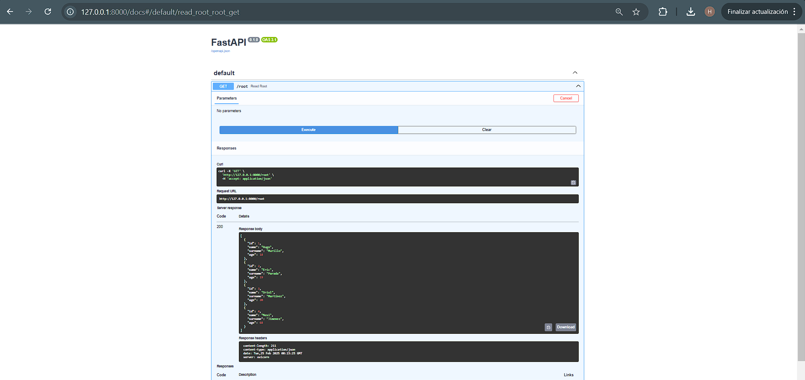

# sge_theBear_grupG

# Projecte FastAPI - DAM1 - Hugo Murillo Caparrós

## Configuració del projecte
### 1. Crear estructura de directoris

Afegir un fitxer `__init__.py` buit a cada carpeta.

### 2. Crear `connect.py`

Fitxer situat a `database/connect.py` per gestionar la connexió a la base de dades amb `psycopg2`

### 3. Crear `read_sch.py`

Fitxer situat a `schema/read_sch.py` per transformar dades en diccionari.

### 4. Crear `read.py`

Fitxer situat a `services/read.py` amb la lògica per gestionar les consultes.

### 5. Crear `main.py`
Fitxer principal que actua com a controlador.

## Execució del projecte
Executar el servidor amb:

python -m uvicorn main:app --reload

Accedir a `http://127.0.0.1:8000` per veure l'API.

Per veure la documentació accedim a `http://127.0.0.1:8000/docs`.

